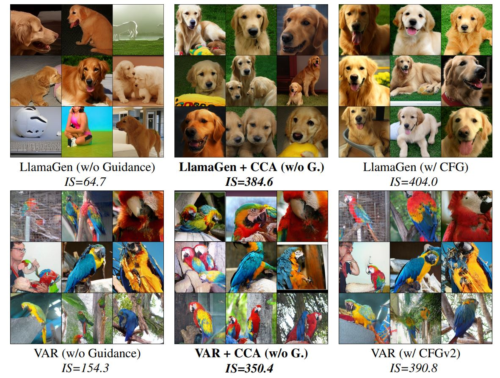
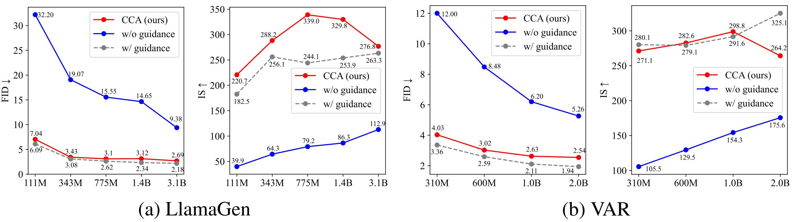
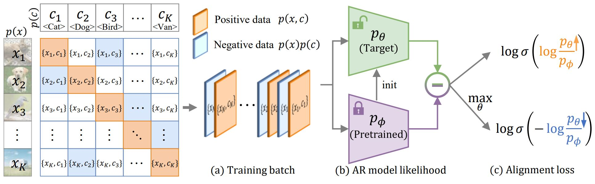

# Condition Contrastive Alignment (CCA): Autoregressive Visual Generation Without Guided Sampling

<p align="center">

<p>

This repo contains model weights and training/sampling PyTorch codes used in

> [**Toward Guidance-Free AR Visual Generation via Condition Contrastive Alignment**](https://arxiv.org/abs/2410.09347)<br>
> [Huayu Chen](https://chendrag.github.io/), [Hang Su](https://www.suhangss.me/), [Peize Sun](https://peizesun.github.io/), [Jun Zhu](https://ml.cs.tsinghua.edu.cn/~jun/index.shtml)
> <br>Tsinghua, HKU<br>

## 🔥 Update
- [2024.10.16] Model weights are now released!
- [2024.10.14] Code and arxiv paper are now publicly available!

## 🌿 Introduction
(TL;DR) We propose CCA as a finetuning technique for AR visual models so that they can generate high-quality images without CFG, cutting sampling costs by half. CCA and CFG has the same theoretical foundations and thus similar features, though CCA is inspired from LLM alignment instead of guided sampling.

Features of CCA:
* **High performance.** CCA can vastly improve guidance-free performance of all tested AR visual models, largely removing the need for CFG. (Figure below)
* **Convenient to deploy.** CCA does not require any additional datasets other than the one used for pretraining. 
* **Fast to train.** CCA requires only finetuning pretrained models for 1 epoch to achieve ideal performance (~1% computation of pretraining). 
* **Consistency with LLM Alignment.** CCA is theoretically foundationed on exitsing [LLM alignment methods](https://arxiv.org/abs/2402.05369), and bridges the gap between visual-targeted guidance and language-targeted alignment, offering a unified framework for mixed-modal modeling. 


<p align="center">

<p>

<p align="center">

<p>


## Model Zoo

CCA only finetunes conditional AR visual models. Weights for pretrained [VAR](https://github.com/FoundationVision/VAR?tab=readme-ov-file#var-zoo) and [LlamaGen](https://github.com/FoundationVision/LlamaGen?tab=readme-ov-file#-class-conditional-image-generation-on-imagenet) models, as well as tokenizers, are publicly accessible in their respective repos.

If you are only interested in evaluating our CCA-finetuned models, please checkout the released ckpts below.

### VAR+CCA

|  Base model    | reso. | #params |   FID  (w/o CFG)   | HF weights🤗                                                                        |
|:----------:|:-----:|:--------:|:---------:|:------------------------------------------------------------------------------------|
|  VAR-d16+CCA   |  256  |  310M   |   4.03   |[var_d16.pth](https://huggingface.co/ChenDRAG/CCA_VAR/resolve/main/CCA_VAR_Guidance_Free/VAR_d16_CCA.pth) |
|  VAR-d20+CCA   |  256  |  600M   |   3.02    | [var_d20.pth](https://huggingface.co/ChenDRAG/CCA_VAR/resolve/main/CCA_VAR_Guidance_Free/VAR_d20_CCA.pth) |
|  VAR-d24+CCA   |  256  |  1.0B   |   2.63    | [var_d24.pth](https://huggingface.co/ChenDRAG/CCA_VAR/resolve/main/CCA_VAR_Guidance_Free/VAR_d24_CCA.pth) |
|  VAR-d30+CCA   |  256  |  2.0B   |   2.54    | [var_d30.pth](https://huggingface.co/ChenDRAG/CCA_VAR/resolve/main/CCA_VAR_Guidance_Free/VAR_d30_CCA.pth) |
|  [All](https://huggingface.co/ChenDRAG/CCA_VAR/tree/main/CCA_VAR_Guidance_Free)   |   |   |      |  |


### LlamaGen+CCA


|   model    | reso. | #params |   FID  (w/o CFG)  | HF weights🤗                                                                        |
|:----------:|:-----:|:--------:|:---------:|:------------------------------------------------------------------------------------|
|  LlamaGen-B+CCA   |  384 |  111M   |   7.04     |[c2i_B_384.pt](https://huggingface.co/ChenDRAG/CCA_LlamaGen/blob/main/CCA_LlamaGen_Guidance_Free/c2i_B_384_CCA_0005000.pt) |
|  LlamaGen-L+CCA   |  384 |  343M   |   3.43    | [c2i_L_384.pt](https://huggingface.co/ChenDRAG/CCA_LlamaGen/blob/main/CCA_LlamaGen_Guidance_Free/c2i_L_384_CCA_0005000.pt) |
|  LlamaGen-XL+CCA   |  384 |  775M   |   3.10   | [c2i_XL_384.pt](https://huggingface.co/ChenDRAG/CCA_LlamaGen/blob/main/CCA_LlamaGen_Guidance_Free/c2i_XL_384_CCA_0005000.pt) |
|  LlamaGen-XXL+CCA  |  384 |  1.4B   |   3.12    | [c2i_XXL_384.pt](https://huggingface.co/ChenDRAG/CCA_LlamaGen/blob/main/CCA_LlamaGen_Guidance_Free/c2i_XXL_384_CCA_0005000.pt) |
|  LlamaGen-3B+CCA   |  384 |  3.0B   |   2.69    | [c2i_3B_384.pt](https://huggingface.co/ChenDRAG/CCA_LlamaGen/blob/main/CCA_LlamaGen_Guidance_Free/c2i_3B_384_CCA_0005000.pt) |
|  [All](https://huggingface.co/ChenDRAG/CCA_LlamaGen/tree/main/CCA_LlamaGen_Guidance_Free)   |  |    |      |  |


<!-- https://huggingface.co/ChenDRAG/CCA_LlamaGen/tree/main/CCA_LlamaGen_w_CFG -->

## Training
Before proceed, please download the ImageNet dataset and pretrained [VAR](https://github.com/FoundationVision/VAR?tab=readme-ov-file#var-zoo) or [LlamaGen](https://github.com/FoundationVision/LlamaGen?tab=readme-ov-file#-class-conditional-image-generation-on-imagenet) models as well their respective tokenizers.

### VAR Command


### LlamaGen Command

## Evaluation


## BibTeX
If you find our project helpful, please cite
```bibtex
@article{chen2024CCA,
  title={Toward Guidance-Free AR Visual Generation via Condition Contrastive Alignment},
  author={Chen, Huayu and Su, Hang and Sun, Peize and Zhu, Jun},
  journal={arXiv preprint arXiv:2410.09347},
  year={2024}
}
```